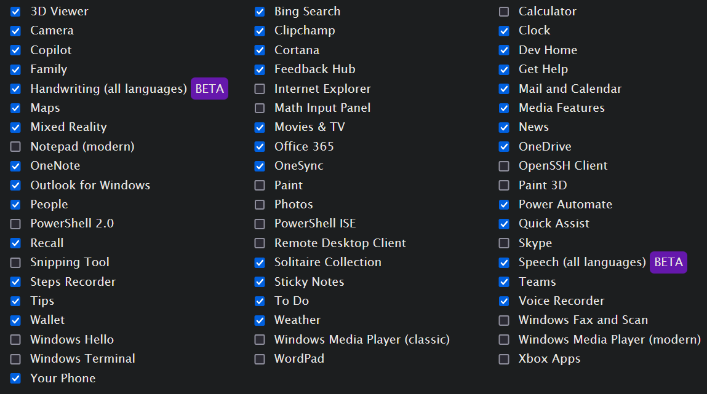

# Windows 11 Unattended Answer File

Этот файл ответов был сгенерирован с помощью [Unattend Generator](https://schneegans.de/windows/unattend-generator/) для автоматической установки и настройки Windows 11. Ниже перечислены параметры, которые я настроил для своих нужд.

## Содержание

- [Общие настройки](#Общие-настройки)
- [Настройки системы](#Настройки-системы)
- [Настройки проводника](#Настройки-проводника)
- [Удаление ненужного ПО](#Удаление-ненужного-ПО)
- [Настройка меню Пуск](#Настройка-меню-Пуск)

## Общие настройки

- **Регион и язык**:  
  - Основной язык: **English (United States)**
  - Вторичный язык: **Russian (Russia)**  
  - **Домашнее местоположение**: **Russia**
  
- **Архитектура процессора**: **64-бит**

- **Обход проверки TPM**: Включен.

- **Имя компьютера**: Случайное имя, чтобы избежать путаницы при установке на нескольких устройствах.

- **Compact OS**: **Отключено** (так как на моих устройствах достаточно места).

- **Часовой пояс**: **Томск (Russia)**.

- **Версия Windows**: **Pro** (Generic key).

- **Пользовательские учетные записи**: Создаю **администратора без пароля**.

- **Политика истечения пароля**: Пароли не истекают.

- **Политика блокировки учетной записи**: Используется стандартная политика.

---

## Настройки системы

- **Windows Defender**: **Отключен**.
  
- **Windows Update**: **Включено** (не отключаю обновления).

- **User Account Control (UAC)**: **Отключен**.

- **Smart App Control**: **Отключен**.

- **SmartScreen (Windows и Edge)**: **Отключен**.

- **Fast Startup**: **Отключен**.

- **Системное восстановление**: **Отключено**.

- **Длинные пути**: **Включено** (хотя это должно быть включено в новых версиях по умолчанию).

- **Удаленный рабочий стол (RDP)**: **Включен**.

- **Harden ACLs**: **Отключено**.

- **Разрешение выполнения PowerShell скриптов**: **Включено**.

- **Не обновлять временную метку последнего доступа**: **Отключено**.

- **Предотвратить автоматическую перезагрузку после обновлений**: **Включено**.

- **Отключить системные звуки**: **Отключено**.

- **Отключение предложений приложений (Content Delivery Manager)**: **Включено**.

- **Предотвратить шифрование устройства**: **Включено**.

- **Скрыть первое использование Edge**: **Включено**.

- **Сделать Edge удаляемым**: **Включено**.

- **Отключить точность указателя**: **Включено**.

- **Аудит создания процессов и командной строки**: **Включено** (на всякий случай, может пригодиться).

---

## Настройки проводника

- **Показ скрытых файлов**: **Включено**.
  
- **Поиск в панели задач**: **Скрыть**.

- **Всегда показывать расширения файлов**: **Включено**.

- **Отключить виджеты**: **Включено**.

- **Использовать классическое контекстное меню**: **Включено**.

- **Выравнивание панели задач по левому краю**: **Включено**.

- **Удаление предустановленных иконок с панели задач**: **Включено** (например, Edge, Outlook, Microsoft Store).

- **Показывать все значки в системном лотке**: **Включено**.

- **Скрыть кнопку "Task View" на панели задач**: **Включено**.

- **Открытие Проводника в "Этот компьютер" вместо "Быстрого доступа"**: **Включено**.

- **Не показывать результаты поиска Bing в меню Пуск и поисковой строке**: **Включено**.

---

## Удаление ненужного ПО

Удалены следующие компоненты:

- **3D Viewer**  
- **Bing Search**  
- **Camera**  
- **Clipchamp**  
- **Clock**  
- **Copilot**  
- **Cortana**  
- **Dev Home**  
- **Family**  
- **Feedback Hub**  
- **Get Help**  
- **Handwriting (all languages)**  
- **Mail and Calendar**  
- **Maps**  
- **Media Features**  
- **Mixed Reality**  
- **Movies & TV**  
- **News**  
- **Office 365**  
- **OneDrive**  
- **OneNote**  
- **OneSync**  
- **Outlook for Windows**  
- **People**  
- **Power Automate**  
- **Quick Assist**  
- **Recall**  
- **Skype**  
- **Solitaire Collection**  
- **Speech (all languages)**  
- **Steps Recorder**  
- **Sticky Notes**  
- **Teams**  
- **Tips**  
- **To Do**  
- **Voice Recorder**  
- **Wallet**  
- **Weather**  
- **Your Phone**  

---

## Настройка меню Пуск

- **Убраны стандартные закрепленные приложения (Remove all pins)**.

---

### Примечания:
- Этот файл ответов был создан с учетом специфических предпочтений для удобства работы, но в вашем случае вы можете легко изменить параметры в соответствии с вашими требованиями.
- В настройках по умолчанию для некоторых компонентов безопасности могут быть определенные ограничения (например, Windows Defender), но это можно изменить в зависимости от нужд.